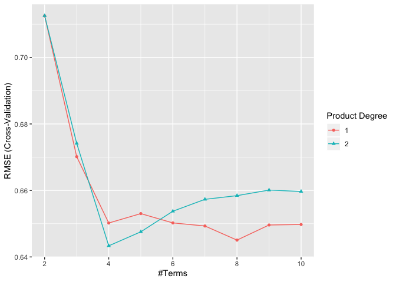

P8106\_MP\_xh2395
================
Xin He
4/4/2020

## Set random seed

``` r
set.seed(2020)
```

## Import the data

``` r
wine_df = read_csv("./data/winequality_red.csv")
```

## Set train data and test data

``` r
trRows = createDataPartition(wine_df$quality, p = .75, list = F)

train_df = wine_df[trRows,]

test_df = wine_df[-trRows,]
```

## Define X, Y and control

``` r
# full data
full_X = model.matrix(quality ~ .,wine_df)[,-1]
full_Y = wine_df$quality
# train data
train_X = model.matrix(quality ~ .,train_df)[,-1]
train_Y = train_df$quality
# test data
test_X = model.matrix(quality ~ .,test_df)[,-1]
test_Y = test_df$quality

train_control = trainControl(method = "cv",number = 10)
```

## Create Scatter Plots

response vs
predictors

``` r
featurePlot(full_X, full_Y, plot = "scatter", labels = c("","Y"), type = c("p"), layout = c(3, 4))
```


## Linear model

### Fit a linear model using least squares on the training data

``` r
lm_fit = train(
    x = train_X,
    y = train_Y, 
    method = 'lm',
    trControl = train_control,
    metric = 'RMSE'
)
```

### Summary

``` r
summary(lm_fit)
```

    ## 
    ## Call:
    ## lm(formula = .outcome ~ ., data = dat)
    ## 
    ## Residuals:
    ##      Min       1Q   Median       3Q      Max 
    ## -2.70720 -0.35757 -0.04139  0.45009  2.00135 
    ## 
    ## Coefficients:
    ##                                Estimate Std. Error t value Pr(>|t|)    
    ## (Intercept)                   1.576e+01  2.517e+01   0.626 0.531347    
    ## `\\`fixed acidity\\``         4.446e-03  3.068e-02   0.145 0.884796    
    ## `\\`volatile acidity\\``     -9.743e-01  1.367e-01  -7.128 1.77e-12 ***
    ## `\\`citric acid\\``          -2.991e-02  1.715e-01  -0.174 0.861581    
    ## `\\`residual sugar\\``       -2.981e-03  1.849e-02  -0.161 0.871934    
    ## chlorides                    -1.823e+00  5.240e-01  -3.479 0.000522 ***
    ## `\\`free sulfur dioxide\\``   6.001e-03  2.567e-03   2.338 0.019562 *  
    ## `\\`total sulfur dioxide\\`` -3.938e-03  8.563e-04  -4.599 4.70e-06 ***
    ## density                      -1.132e+01  2.567e+01  -0.441 0.659388    
    ## pH                           -5.337e-01  2.202e-01  -2.424 0.015504 *  
    ## sulphates                     9.439e-01  1.276e-01   7.399 2.59e-13 ***
    ## alcohol                       2.917e-01  3.140e-02   9.287  < 2e-16 ***
    ## ---
    ## Signif. codes:  0 '***' 0.001 '**' 0.01 '*' 0.05 '.' 0.1 ' ' 1
    ## 
    ## Residual standard error: 0.6501 on 1188 degrees of freedom
    ## Multiple R-squared:  0.3683, Adjusted R-squared:  0.3625 
    ## F-statistic: 62.97 on 11 and 1188 DF,  p-value: < 2.2e-16

R-squared: 0.3683

### Calculate the mean square error using the test data

``` r
train_mse = mean(lm_fit$residuals^2)
train_mse
```

    ## [1] NaN

``` r
lm_predict_Y = predict.train(lm_fit, test_X)
lm_test_mse = mean((test_Y - lm_predict_Y) ^ 2)
lm_test_mse
```

    ## [1] 0.416906

## Ridge regression model

### Fit a ridge regression model on the training data, with lambda chosen by cross-validation

``` r
ridge_fit = train(
    x = train_X,
    y = train_Y, 
    method = 'glmnet',
    tuneGrid = expand.grid(alpha = 0,lambda = exp(seq(-8, 10, length = 100))),
    trControl = train_control,
    metric = 'RMSE'
)
```

### Summary

``` r
ridge_fit$bestTune
```

    ##    alpha     lambda
    ## 27     0 0.03790291

``` r
coef(ridge_fit$finalModel, ridge_fit$bestTune$lambda)
```

    ## 12 x 1 sparse Matrix of class "dgCMatrix"
    ##                                    1
    ## (Intercept)             31.187531467
    ## `fixed acidity`          0.018803017
    ## `volatile acidity`      -0.929424291
    ## `citric acid`            0.031242611
    ## `residual sugar`         0.003292101
    ## chlorides               -1.750103982
    ## `free sulfur dioxide`    0.004952667
    ## `total sulfur dioxide`  -0.003602773
    ## density                -27.161365213
    ## pH                      -0.388721717
    ## sulphates                0.927395116
    ## alcohol                  0.264195143

### Plot

``` r
plot(ridge_fit, xTrans = function(x)log(x))
```


### Report the test error

``` r
ridge_predict_Y = predict.train(ridge_fit, test_X)
ridge_test_mse = mean((test_Y - ridge_predict_Y)^2)

ridge_test_mse
```

    ## [1] 0.4154898

## Lasso regression model

### Fit a lasso regression model on the training data, with lambda chosen by cross-validation

``` r
lasso_fit = train(
    x = train_X,
    y = train_Y, 
    method = 'glmnet',
    tuneGrid = expand.grid(alpha = 1,lambda = exp(seq(-8, 10, length = 100))),
    trControl = train_control
)
```

### Summary

``` r
lasso_fit$bestTune
```

    ##    alpha      lambda
    ## 17     1 0.006152424

``` r
coef(lasso_fit$finalModel,lasso_fit$bestTune$lambda)
```

    ## 12 x 1 sparse Matrix of class "dgCMatrix"
    ##                                    1
    ## (Intercept)            10.2608767293
    ## `fixed acidity`         .           
    ## `volatile acidity`     -0.9748068836
    ## `citric acid`           .           
    ## `residual sugar`       -0.0006122828
    ## chlorides              -1.6327485797
    ## `free sulfur dioxide`   0.0041052968
    ## `total sulfur dioxide` -0.0033792702
    ## density                -5.9933202042
    ## pH                     -0.4635003403
    ## sulphates               0.8962790690
    ## alcohol                 0.2917985146

The number of non-zero coefficient estimates (exclude intercept) is
10.

### Plot

``` r
plot(lasso_fit, xTrans = function(x)log(x))
```


### Report the test error

``` r
lasso_predict_Y = predict.train(lasso_fit, test_X)
lasso_test_mse = mean((test_Y - lasso_predict_Y)^2)

lasso_test_mse
```

    ## [1] 0.4149329

## Principle component regression model

### Fit a pcr model on the training data, with M chosen by cross-validation

``` r
pcr_fit = train(
    x = train_X,
    y = train_Y, 
    method = 'pcr',
    tuneLength = length(train_df) - 1,
    trControl = train_control,
    scale = TRUE
)
```

### Summary

``` r
pcr_fit$bestTune
```

    ##   ncomp
    ## 9     9

The value of M selected by cross-validation is
9.

### Plot

``` r
plot(pcr_fit)
```


### Report the test error

``` r
pcr_predict_Y = predict.train(pcr_fit, test_X)
pcr_test_mse = mean((test_Y - pcr_predict_Y)^2)

pcr_test_mse
```

    ## [1] 0.4188731

## Smoothing Spline Model

### The degree of freedom obtained by generalized cv

``` r
fit.ss = smooth.spline(wine_df$alcohol, wine_df$quality)
fit.ss$df
```

    ## [1] 17.96074

### Plot the resulting fit

``` r
alcohollims = range(wine_df$alcohol)
alcohol.grid = seq(from = alcohollims[1],to = alcohollims[2])
pred.ss = predict(fit.ss,
                   x = alcohol.grid)
pred.ss.df = data.frame(pred = pred.ss$y,
                         alcohol = alcohol.grid)
p_0 = ggplot(data = wine_df, aes(x = alcohol, y = quality)) +
  geom_point(color = rgb(.2, .4, .2, .5))
p_ss = p_0 + 
  geom_line(aes(x = alcohol, y = pred), data = pred.ss.df,
          color = rgb(.8, .1, .1, 1)) +
  labs(title = "Degree of freedom: 17.96074 (obtained by generalized cv)")
p_ss
```


## Generalized Additive Model

### Fit GAM model

``` r
wine_df1 = wine_df %>% 
  rename(fixed_acidity = `fixed acidity`,
         volatile_acidity = `volatile acidity`,
         citric_acid = `citric acid`,
         residual_sugar =`residual sugar`,
         free_sulfur_dioxide = `free sulfur dioxide`,
         total_sulfur_dioxide =`total sulfur dioxide`)

full1_X = model.matrix(quality ~ .,wine_df1)[,-1]
full1_Y = wine_df1$quality

gam_fit = train(full1_X, full1_Y,
                 method = "gam",
                 tuneGrid = data.frame(method = "GCV.Cp", 
                                       select = c(TRUE,FALSE)), 
                 trControl = train_control)
```

### Summary

``` r
gam_fit$bestTune
```

    ##   select method
    ## 2   TRUE GCV.Cp

``` r
gam_fit$finalModel
```

    ## 
    ## Family: gaussian 
    ## Link function: identity 
    ## 
    ## Formula:
    ## .outcome ~ s(free_sulfur_dioxide) + s(alcohol) + s(citric_acid) + 
    ##     s(pH) + s(residual_sugar) + s(fixed_acidity) + s(sulphates) + 
    ##     s(volatile_acidity) + s(total_sulfur_dioxide) + s(chlorides) + 
    ##     s(density)
    ## 
    ## Estimated degrees of freedom:
    ## 2.935 7.168 4.027 0.783 4.598 1.850 4.223 
    ## 6.929 6.872 7.485 7.333  total = 55.2 
    ## 
    ## GCV score: 0.394785

``` r
summary(gam_fit)
```

    ## 
    ## Family: gaussian 
    ## Link function: identity 
    ## 
    ## Formula:
    ## .outcome ~ s(free_sulfur_dioxide) + s(alcohol) + s(citric_acid) + 
    ##     s(pH) + s(residual_sugar) + s(fixed_acidity) + s(sulphates) + 
    ##     s(volatile_acidity) + s(total_sulfur_dioxide) + s(chlorides) + 
    ##     s(density)
    ## 
    ## Parametric coefficients:
    ##             Estimate Std. Error t value Pr(>|t|)    
    ## (Intercept)  5.63602    0.01544     365   <2e-16 ***
    ## ---
    ## Signif. codes:  0 '***' 0.001 '**' 0.01 '*' 0.05 '.' 0.1 ' ' 1
    ## 
    ## Approximate significance of smooth terms:
    ##                            edf Ref.df      F  p-value    
    ## s(free_sulfur_dioxide)  2.9348      9  0.573 0.124101    
    ## s(alcohol)              7.1676      9  9.953  < 2e-16 ***
    ## s(citric_acid)          4.0274      9  0.791 0.100577    
    ## s(pH)                   0.7828      9  0.968 0.000317 ***
    ## s(residual_sugar)       4.5980      9  0.867 0.107016    
    ## s(fixed_acidity)        1.8498      9  0.728 0.009892 ** 
    ## s(sulphates)            4.2230      9 15.909  < 2e-16 ***
    ## s(volatile_acidity)     6.9289      9  7.711 2.38e-13 ***
    ## s(total_sulfur_dioxide) 6.8725      9  3.719 5.91e-06 ***
    ## s(chlorides)            7.4846      9  2.745 0.000576 ***
    ## s(density)              7.3334      9  1.687 0.023025 *  
    ## ---
    ## Signif. codes:  0 '***' 0.001 '**' 0.01 '*' 0.05 '.' 0.1 ' ' 1
    ## 
    ## R-sq.(adj) =  0.416   Deviance explained = 43.5%
    ## GCV = 0.39479  Scale est. = 0.38116   n = 1599

## Plot

``` r
gam = gam(quality ~ s(free_sulfur_dioxide) + s(alcohol) + s(citric_acid) + 
    s(pH) + s(residual_sugar) + s(fixed_acidity) + s(sulphates) + 
    s(volatile_acidity) + s(total_sulfur_dioxide) + s(chlorides) + 
    s(density), data = wine_df1)

par(mfrow = c(4,3))
plot(gam)
```


## Multivariate Adaptive Regression Splines Model

### Fit MARS model

``` r
mars_grid = expand.grid(degree = 1:2,
                         nprune = 2:10)

mars_fit = train(train_X, train_Y, 
                  method = "earth",
                  tuneGrid = mars_grid,
                  trControl = train_control)
```

### Summary

``` r
mars_fit$bestTune
```

    ##    nprune degree
    ## 12      4      2

``` r
coef(mars_fit$finalModel)
```

    ##                                            (Intercept) 
    ##                                             6.00559962 
    ##                                        h(12.1-alcohol) 
    ##                                            -0.34227883 
    ## h(0.84-volatile acidity) * h(126-total sulfur dioxide) 
    ##                                             0.01489138 
    ##         h(65-total sulfur dioxide) * h(0.76-sulphates) 
    ##                                            -0.04808887

``` r
summary(mars_fit)
```

    ## Call: earth(x=matrix[1200,11], y=c(5,5,5,6,5,5,7...), keepxy=TRUE,
    ##             degree=2, nprune=4)
    ## 
    ##                                                        coefficients
    ## (Intercept)                                               6.0055996
    ## h(12.1-alcohol)                                          -0.3422788
    ## h(0.84-volatile acidity) * h(126-total sulfur dioxide)    0.0148914
    ## h(65-total sulfur dioxide) * h(0.76-sulphates)           -0.0480889
    ## 
    ## Selected 4 of 23 terms, and 4 of 11 predictors
    ## Termination condition: Reached nk 23
    ## Importance: alcohol, sulphates, `volatileacidity`, ...
    ## Number of terms at each degree of interaction: 1 1 2
    ## GCV 0.4161648    RSS 492.3481    GRSq 0.3728199    RSq 0.3806417

### Plot

``` r
ggplot(mars_fit)
```



## Compare different models

``` r
resamp = resamples(list(lm = lm_fit,
                        ridge = ridge_fit,
                        lasso = lasso_fit,
                        pcr = pcr_fit,
                        gam = gam_fit,
                        mars = mars_fit))

summary(resamp)
```

    ## 
    ## Call:
    ## summary.resamples(object = resamp)
    ## 
    ## Models: lm, ridge, lasso, pcr, gam, mars 
    ## Number of resamples: 10 
    ## 
    ## MAE 
    ##            Min.   1st Qu.    Median      Mean   3rd Qu.      Max. NA's
    ## lm    0.4342319 0.4691431 0.5042714 0.5017788 0.5330365 0.5665433    0
    ## ridge 0.4534667 0.4832119 0.4903573 0.5029094 0.5155260 0.5952779    0
    ## lasso 0.4591527 0.4707148 0.4900415 0.5033725 0.5284439 0.5858150    0
    ## pcr   0.4364074 0.4775725 0.4986497 0.5018887 0.5150067 0.5757639    0
    ## gam   0.4580594 0.4837320 0.4944497 0.5005825 0.5148585 0.5578730    0
    ## mars  0.4401873 0.4776442 0.4987160 0.5004253 0.5267184 0.5586196    0
    ## 
    ## RMSE 
    ##            Min.   1st Qu.    Median      Mean   3rd Qu.      Max. NA's
    ## lm    0.5779289 0.6250236 0.6626994 0.6532942 0.6847714 0.7083816    0
    ## ridge 0.5906911 0.6309376 0.6499327 0.6531035 0.6717569 0.7400069    0
    ## lasso 0.5790587 0.6133455 0.6333915 0.6515125 0.6842411 0.7574095    0
    ## pcr   0.5848335 0.6080756 0.6518623 0.6526109 0.6975966 0.7223157    0
    ## gam   0.6019513 0.6246506 0.6403150 0.6432048 0.6616430 0.7017351    0
    ## mars  0.5698264 0.6199849 0.6338825 0.6433405 0.6791219 0.7237716    0
    ## 
    ## Rsquared 
    ##            Min.   1st Qu.    Median      Mean   3rd Qu.      Max. NA's
    ## lm    0.2542892 0.3192557 0.3552967 0.3589953 0.3952502 0.4436765    0
    ## ridge 0.2604142 0.3098512 0.3667993 0.3595150 0.4166652 0.4284589    0
    ## lasso 0.2889841 0.3386261 0.3652842 0.3632421 0.3891152 0.4203412    0
    ## pcr   0.2202585 0.3613208 0.3802730 0.3632000 0.3925286 0.4118652    0
    ## gam   0.3182767 0.3427707 0.3611970 0.3670815 0.3891866 0.4361561    0
    ## mars  0.3041553 0.3266000 0.3694167 0.3771093 0.4234499 0.4952056    0

``` r
bwplot(resamp, metric = "RMSE")
```


