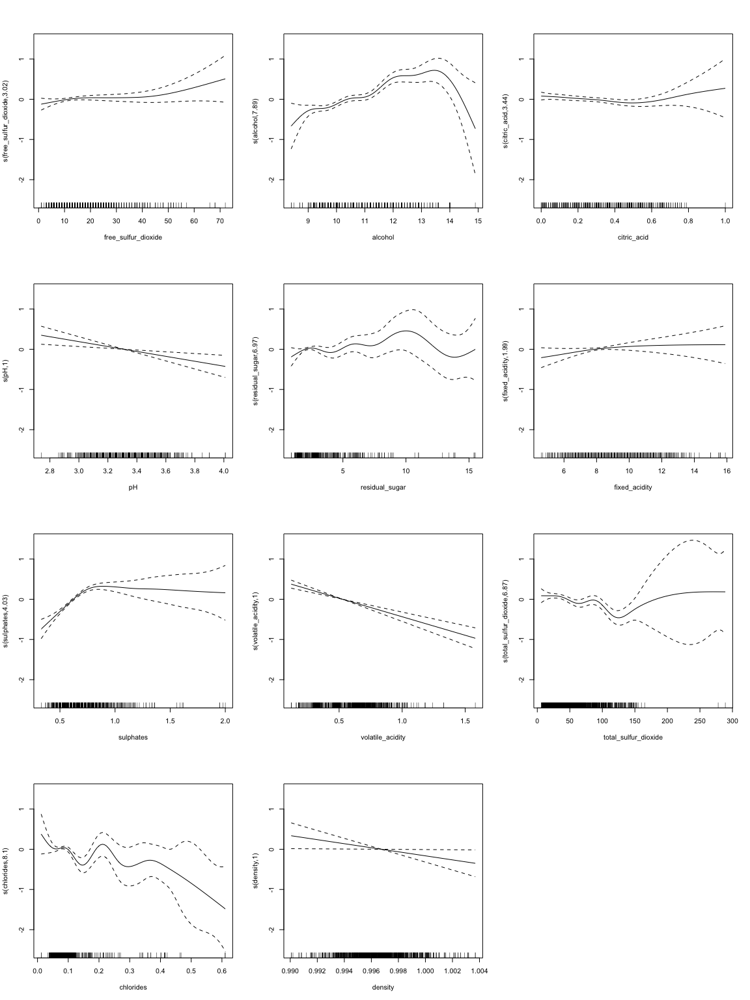

P8106\_MP\_xh2395
================
Xin He
4/4/2020

## Set random seed

``` r
set.seed(2020)
```

## Import the data

``` r
wine_df = read_csv("./data/winequality_red.csv")
```

## Set train data and test data

``` r
trRows = createDataPartition(wine_df$quality, p = .75, list = F)

train_df = wine_df[trRows,]

test_df = wine_df[-trRows,]
```

## Define X, Y and control

``` r
# full data
full_X = model.matrix(quality ~ .,wine_df)[,-1]
full_Y = wine_df$quality
# train data
train_X = model.matrix(quality ~ .,train_df)[,-1]
train_Y = train_df$quality
# test data
test_X = model.matrix(quality ~ .,test_df)[,-1]
test_Y = test_df$quality

train_control = trainControl(method = "cv",number = 10)
```

## Create Scatter Plots

response vs
predictors

``` r
featurePlot(full_X, full_Y, plot = "scatter", labels = c("","Y"), type = c("p"), layout = c(3, 4))
```


## Linear model

### Fit a linear model using least squares on the training data

``` r
lm_fit = train(
    x = train_X,
    y = train_Y, 
    method = 'lm',
    trControl = train_control,
    metric = 'RMSE'
)
```

### Summary

``` r
summary(lm_fit)
```

    ## 
    ## Call:
    ## lm(formula = .outcome ~ ., data = dat)
    ## 
    ## Residuals:
    ##      Min       1Q   Median       3Q      Max 
    ## -2.70720 -0.35757 -0.04139  0.45009  2.00135 
    ## 
    ## Coefficients:
    ##                                Estimate Std. Error t value Pr(>|t|)    
    ## (Intercept)                   1.576e+01  2.517e+01   0.626 0.531347    
    ## `\\`fixed acidity\\``         4.446e-03  3.068e-02   0.145 0.884796    
    ## `\\`volatile acidity\\``     -9.743e-01  1.367e-01  -7.128 1.77e-12 ***
    ## `\\`citric acid\\``          -2.991e-02  1.715e-01  -0.174 0.861581    
    ## `\\`residual sugar\\``       -2.981e-03  1.849e-02  -0.161 0.871934    
    ## chlorides                    -1.823e+00  5.240e-01  -3.479 0.000522 ***
    ## `\\`free sulfur dioxide\\``   6.001e-03  2.567e-03   2.338 0.019562 *  
    ## `\\`total sulfur dioxide\\`` -3.938e-03  8.563e-04  -4.599 4.70e-06 ***
    ## density                      -1.132e+01  2.567e+01  -0.441 0.659388    
    ## pH                           -5.337e-01  2.202e-01  -2.424 0.015504 *  
    ## sulphates                     9.439e-01  1.276e-01   7.399 2.59e-13 ***
    ## alcohol                       2.917e-01  3.140e-02   9.287  < 2e-16 ***
    ## ---
    ## Signif. codes:  0 '***' 0.001 '**' 0.01 '*' 0.05 '.' 0.1 ' ' 1
    ## 
    ## Residual standard error: 0.6501 on 1188 degrees of freedom
    ## Multiple R-squared:  0.3683, Adjusted R-squared:  0.3625 
    ## F-statistic: 62.97 on 11 and 1188 DF,  p-value: < 2.2e-16

R-squared: 0.3683

### Calculate the mean square error using the test data

``` r
train_mse = mean(lm_fit$residuals^2)
train_mse
```

    ## [1] NaN

``` r
lm_predict_Y = predict.train(lm_fit, test_X)
lm_test_mse = mean((test_Y - lm_predict_Y) ^ 2)
lm_test_mse
```

    ## [1] 0.416906

## Ridge regression model

### Fit a ridge regression model on the training data, with lambda chosen by cross-validation

``` r
ridge_fit = train(
    x = train_X,
    y = train_Y, 
    method = 'glmnet',
    tuneGrid = expand.grid(alpha = 0,lambda = exp(seq(-8, 10, length = 100))),
    trControl = train_control,
    metric = 'RMSE'
)
```

### Summary

``` r
ridge_fit$bestTune
```

    ##    alpha     lambda
    ## 27     0 0.03790291

``` r
coef(ridge_fit$finalModel, ridge_fit$bestTune$lambda)
```

    ## 12 x 1 sparse Matrix of class "dgCMatrix"
    ##                                    1
    ## (Intercept)             31.187531467
    ## `fixed acidity`          0.018803017
    ## `volatile acidity`      -0.929424291
    ## `citric acid`            0.031242611
    ## `residual sugar`         0.003292101
    ## chlorides               -1.750103982
    ## `free sulfur dioxide`    0.004952667
    ## `total sulfur dioxide`  -0.003602773
    ## density                -27.161365213
    ## pH                      -0.388721717
    ## sulphates                0.927395116
    ## alcohol                  0.264195143

### Plot

``` r
plot(ridge_fit, xTrans = function(x)log(x))
```


### Report the test error

``` r
ridge_predict_Y = predict.train(ridge_fit, test_X)
ridge_test_mse = mean((test_Y - ridge_predict_Y)^2)

ridge_test_mse
```

    ## [1] 0.4154898

## Lasso regression model

### Fit a lasso regression model on the training data, with lambda chosen by cross-validation

``` r
lasso_fit = train(
    x = train_X,
    y = train_Y, 
    method = 'glmnet',
    tuneGrid = expand.grid(alpha = 1,lambda = exp(seq(-8, 10, length = 100))),
    trControl = train_control
)
```

### Summary

``` r
lasso_fit$bestTune
```

    ##    alpha      lambda
    ## 17     1 0.006152424

``` r
coef(lasso_fit$finalModel,lasso_fit$bestTune$lambda)
```

    ## 12 x 1 sparse Matrix of class "dgCMatrix"
    ##                                    1
    ## (Intercept)            10.2608767293
    ## `fixed acidity`         .           
    ## `volatile acidity`     -0.9748068836
    ## `citric acid`           .           
    ## `residual sugar`       -0.0006122828
    ## chlorides              -1.6327485797
    ## `free sulfur dioxide`   0.0041052968
    ## `total sulfur dioxide` -0.0033792702
    ## density                -5.9933202042
    ## pH                     -0.4635003403
    ## sulphates               0.8962790690
    ## alcohol                 0.2917985146

The number of non-zero coefficient estimates (exclude intercept) is
10.

### Plot

``` r
plot(lasso_fit, xTrans = function(x)log(x))
```


### Report the test error

``` r
lasso_predict_Y = predict.train(lasso_fit, test_X)
lasso_test_mse = mean((test_Y - lasso_predict_Y)^2)

lasso_test_mse
```

    ## [1] 0.4149329

## Principle component regression model

### Fit a pcr model on the training data, with M chosen by cross-validation

``` r
pcr_fit = train(
    x = train_X,
    y = train_Y, 
    method = 'pcr',
    tuneLength = length(train_df) - 1,
    trControl = train_control,
    scale = TRUE
)
```

### Summary

``` r
pcr_fit$bestTune
```

    ##   ncomp
    ## 9     9

The value of M selected by cross-validation is
9.

### Plot

``` r
plot(pcr_fit)
```


### Report the test error

``` r
pcr_predict_Y = predict.train(pcr_fit, test_X)
pcr_test_mse = mean((test_Y - pcr_predict_Y)^2)

pcr_test_mse
```

    ## [1] 0.4188731

## Smoothing Spline Model

### The degree of freedom obtained by generalized cv

``` r
fit.ss = smooth.spline(wine_df$alcohol, wine_df$quality)
fit.ss$df
```

    ## [1] 17.96074

### Plot the resulting fit

``` r
alcohollims = range(wine_df$alcohol)
alcohol.grid = seq(from = alcohollims[1],to = alcohollims[2])
pred.ss = predict(fit.ss,
                   x = alcohol.grid)
pred.ss.df = data.frame(pred = pred.ss$y,
                         alcohol = alcohol.grid)
p_0 = ggplot(data = wine_df, aes(x = alcohol, y = quality)) +
  geom_point(color = rgb(.2, .4, .2, .5))
p_ss = p_0 + 
  geom_line(aes(x = alcohol, y = pred), data = pred.ss.df,
          color = rgb(.8, .1, .1, 1)) +
  labs(title = "Degree of freedom: 17.96074 (obtained by generalized cv)")
p_ss
```


## Generalized Additive Model

### Fit GAM model

``` r
wine_df1 = wine_df %>% 
  rename(fixed_acidity = `fixed acidity`,
         volatile_acidity = `volatile acidity`,
         citric_acid = `citric acid`,
         residual_sugar =`residual sugar`,
         free_sulfur_dioxide = `free sulfur dioxide`,
         total_sulfur_dioxide =`total sulfur dioxide`)

gam_fit1 = gam(quality ~ fixed_acidity+volatile_acidity+citric_acid+residual_sugar+free_sulfur_dioxide+total_sulfur_dioxide+chlorides+density+pH+sulphates+alcohol, data = wine_df1)

gam_fit2 = gam(quality ~ s(fixed_acidity)+s(volatile_acidity)+s(citric_acid)+s(residual_sugar)+s(free_sulfur_dioxide)+s(total_sulfur_dioxide)+s(chlorides)+s(density)+s(pH)+s(sulphates)+s(alcohol), data = wine_df1)
```

### Summary

``` r
summary(gam_fit1)
```

    ## 
    ## Family: gaussian 
    ## Link function: identity 
    ## 
    ## Formula:
    ## quality ~ fixed_acidity + volatile_acidity + citric_acid + residual_sugar + 
    ##     free_sulfur_dioxide + total_sulfur_dioxide + chlorides + 
    ##     density + pH + sulphates + alcohol
    ## 
    ## Parametric coefficients:
    ##                        Estimate Std. Error t value Pr(>|t|)    
    ## (Intercept)           2.197e+01  2.119e+01   1.036   0.3002    
    ## fixed_acidity         2.499e-02  2.595e-02   0.963   0.3357    
    ## volatile_acidity     -1.084e+00  1.211e-01  -8.948  < 2e-16 ***
    ## citric_acid          -1.826e-01  1.472e-01  -1.240   0.2150    
    ## residual_sugar        1.633e-02  1.500e-02   1.089   0.2765    
    ## free_sulfur_dioxide   4.361e-03  2.171e-03   2.009   0.0447 *  
    ## total_sulfur_dioxide -3.265e-03  7.287e-04  -4.480 8.00e-06 ***
    ## chlorides            -1.874e+00  4.193e-01  -4.470 8.37e-06 ***
    ## density              -1.788e+01  2.163e+01  -0.827   0.4086    
    ## pH                   -4.137e-01  1.916e-01  -2.159   0.0310 *  
    ## sulphates             9.163e-01  1.143e-01   8.014 2.13e-15 ***
    ## alcohol               2.762e-01  2.648e-02  10.429  < 2e-16 ***
    ## ---
    ## Signif. codes:  0 '***' 0.001 '**' 0.01 '*' 0.05 '.' 0.1 ' ' 1
    ## 
    ## 
    ## R-sq.(adj) =  0.356   Deviance explained = 36.1%
    ## GCV = 0.42309  Scale est. = 0.41992   n = 1599

``` r
summary(gam_fit2)
```

    ## 
    ## Family: gaussian 
    ## Link function: identity 
    ## 
    ## Formula:
    ## quality ~ s(fixed_acidity) + s(volatile_acidity) + s(citric_acid) + 
    ##     s(residual_sugar) + s(free_sulfur_dioxide) + s(total_sulfur_dioxide) + 
    ##     s(chlorides) + s(density) + s(pH) + s(sulphates) + s(alcohol)
    ## 
    ## Parametric coefficients:
    ##             Estimate Std. Error t value Pr(>|t|)    
    ## (Intercept)  5.63602    0.01551   363.3   <2e-16 ***
    ## ---
    ## Signif. codes:  0 '***' 0.001 '**' 0.01 '*' 0.05 '.' 0.1 ' ' 1
    ## 
    ## Approximate significance of smooth terms:
    ##                           edf Ref.df      F  p-value    
    ## s(fixed_acidity)        1.995  2.560  1.587 0.219529    
    ## s(volatile_acidity)     1.000  1.000 56.474 9.33e-14 ***
    ## s(citric_acid)          3.439  4.310  1.584 0.165675    
    ## s(residual_sugar)       6.965  7.984  1.386 0.207716    
    ## s(free_sulfur_dioxide)  3.018  3.825  1.550 0.204922    
    ## s(total_sulfur_dioxide) 6.865  7.697  4.286 7.65e-05 ***
    ## s(chlorides)            8.099  8.757  3.323 0.000559 ***
    ## s(density)              1.000  1.000  4.386 0.036401 *  
    ## s(pH)                   1.000  1.000  9.651 0.001926 ** 
    ## s(sulphates)            4.029  4.993 29.143  < 2e-16 ***
    ## s(alcohol)              7.888  8.656 11.137 2.29e-16 ***
    ## ---
    ## Signif. codes:  0 '***' 0.001 '**' 0.01 '*' 0.05 '.' 0.1 ' ' 1
    ## 
    ## R-sq.(adj) =   0.41   Deviance explained = 42.7%
    ## GCV = 0.39633  Scale est. = 0.38485   n = 1599

## Plot

``` r
par(mfrow = c(4,3))
plot(gam_fit2)
```



## Multivariate Adaptive Regression Splines Model

### Fit MARS model

``` r
mars_grid = expand.grid(degree = 1:2,
                         nprune = 2:10)

mars_fit = train(train_X, train_Y, 
                  method = "earth",
                  tuneGrid = mars_grid,
                  trControl = train_control)
```

### Summary

``` r
mars_fit$bestTune
```

    ##   nprune degree
    ## 7      8      1

``` r
coef(mars_fit$finalModel)
```

    ##                 (Intercept)             h(12.1-alcohol) 
    ##                 5.575440225                -0.315275868 
    ##           h(0.76-sulphates)    h(volatile acidity-0.84) 
    ##                -2.129422133                -1.804382736 
    ##    h(0.84-volatile acidity) h(133-total sulfur dioxide) 
    ##                 0.634261092                 0.002306367 
    ##                  h(3.66-pH)          h(0.143-chlorides) 
    ##                 0.628772944                 4.494882307

``` r
summary(mars_fit)
```

    ## Call: earth(x=matrix[1200,11], y=c(5,5,5,6,5,5,7...), keepxy=TRUE,
    ##             degree=1, nprune=8)
    ## 
    ##                             coefficients
    ## (Intercept)                    5.5754402
    ## h(0.84-volatile acidity)       0.6342611
    ## h(volatile acidity-0.84)      -1.8043827
    ## h(0.143-chlorides)             4.4948823
    ## h(133-total sulfur dioxide)    0.0023064
    ## h(3.66-pH)                     0.6287729
    ## h(0.76-sulphates)             -2.1294221
    ## h(12.1-alcohol)               -0.3152759
    ## 
    ## Selected 8 of 21 terms, and 6 of 11 predictors
    ## Termination condition: Reached nk 23
    ## Importance: alcohol, sulphates, `volatileacidity`, chlorides, pH, ...
    ## Number of terms at each degree of interaction: 1 7 (additive model)
    ## GCV 0.4108882    RSS 480.8162    GRSq 0.3807721    RSq 0.3951483

### Plot

``` r
ggplot(mars_fit)
```


## Compare different models

``` r
resamp = resamples(list(lm = lm_fit,
                        ridge = ridge_fit,
                        lasso = lasso_fit,
                        pcr = pcr_fit,
                        mars = mars_fit))

summary(resamp)
```

    ## 
    ## Call:
    ## summary.resamples(object = resamp)
    ## 
    ## Models: lm, ridge, lasso, pcr, mars 
    ## Number of resamples: 10 
    ## 
    ## MAE 
    ##            Min.   1st Qu.    Median      Mean   3rd Qu.      Max. NA's
    ## lm    0.4342319 0.4691431 0.5042714 0.5017788 0.5330365 0.5665433    0
    ## ridge 0.4534667 0.4832119 0.4903573 0.5029094 0.5155260 0.5952779    0
    ## lasso 0.4591527 0.4707148 0.4900415 0.5033725 0.5284439 0.5858150    0
    ## pcr   0.4364074 0.4775725 0.4986497 0.5018887 0.5150067 0.5757639    0
    ## mars  0.4751127 0.4851839 0.4894693 0.5003542 0.5160513 0.5495628    0
    ## 
    ## RMSE 
    ##            Min.   1st Qu.    Median      Mean   3rd Qu.      Max. NA's
    ## lm    0.5779289 0.6250236 0.6626994 0.6532942 0.6847714 0.7083816    0
    ## ridge 0.5906911 0.6309376 0.6499327 0.6531035 0.6717569 0.7400069    0
    ## lasso 0.5790587 0.6133455 0.6333915 0.6515125 0.6842411 0.7574095    0
    ## pcr   0.5848335 0.6080756 0.6518623 0.6526109 0.6975966 0.7223157    0
    ## mars  0.5983057 0.6327709 0.6490922 0.6513287 0.6602516 0.7281447    0
    ## 
    ## Rsquared 
    ##            Min.   1st Qu.    Median      Mean   3rd Qu.      Max. NA's
    ## lm    0.2542892 0.3192557 0.3552967 0.3589953 0.3952502 0.4436765    0
    ## ridge 0.2604142 0.3098512 0.3667993 0.3595150 0.4166652 0.4284589    0
    ## lasso 0.2889841 0.3386261 0.3652842 0.3632421 0.3891152 0.4203412    0
    ## pcr   0.2202585 0.3613208 0.3802730 0.3632000 0.3925286 0.4118652    0
    ## mars  0.2862954 0.3277248 0.3563591 0.3629287 0.3694500 0.4680199    0

``` r
bwplot(resamp, metric = "RMSE")
```


