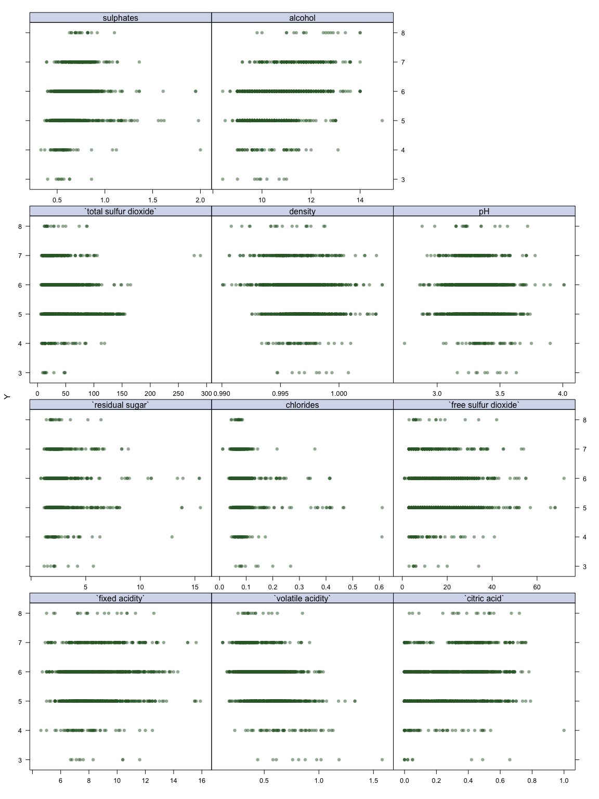
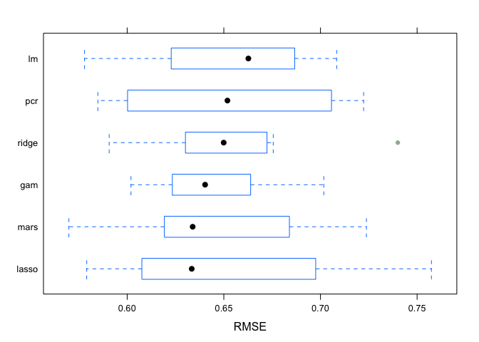
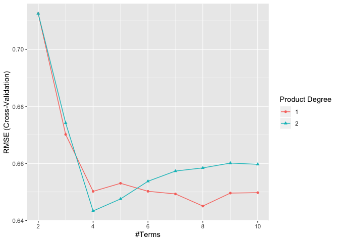

P8106 Midterm Report
================
Xin He
4/5/2020

# Introduction

Once viewed as a luxury good, nowadays red wine is increasingly enjoyed
by a wider range of consumers, including our teammates. We noticed that
the price and quality of differnet brands of red wine differ. We are
interested in investigating what chemical elements of red wine are
related to its quality.

We focused on a dataset named “Red Wine Quality”, which is related to
the Portuguese “Vinho Verde” wine. It includes information about
different chemical elements of red wine and its quality score. The
dataset is composed of 12 variables and 1599 observations. There is no
missing data in our dataset. Among the 12 variables, we chose “quality”
as our outome variable and the other 11 variables as predict variables.
The outcome variable “quality” is based on sensory data and scored
between 0 and 10. The 11 predict variables are fixed acidity, volatile
acidity, citric acid, residual sugar, chlorides, free sulfur dioxide,
total sulfur dioxide, density, pH, sulphates and alcohol.

We are trying to build different models to answer the question that what
is the relationship between 11 chemical elements of red wine and the
quality score of red wine. We seperated the full dataset into a train
dataset and a test dataset. The train dataset includes 1200
observations. The test dataset includes 399 observations.

# Exploratory analysis/visualization

**Response vs
Predictors**

The above figure shows the scatter plots between quality score of red
wine and each 11 predictors. The range of red wine quality score is from
3 to 8. Most of the quality scores lie between 5 and 7. Since the total
range of quality score is from 0 to 10, there is no red wine with
extermely low quality or extremely high quality. We also found that the
relationships between each predictor and quality score are differnt. For
predictor sulphates, total sulfur dioxide, residual sugar, chlorides,
free sulfur dioxide and volatile acidity, the data points are
concentrated at the left part of the plot. For predictor alcohol,
density, pH, fixed acidity and citric acid, the data points are
concentrated at the middle part of the
plot.

# Models

We built Linear Regression Model, Ridge Regression Model, Lasso
Regression Model, Principle Component Regression Model, Generalized
Additive Model and Multivariate Adaptive Regression Splines Model
seperately to fit the data. We used “caret” package to make
cross-validation and used resamp() to compare the six different models.
From the above figure, we can see that the Lasso Regression Model has
the smallest median RMSE.

|      Method       |      MAE      |     RMSE      |   R-squared   |
| :---------------: | :-----------: | :-----------: | :-----------: |
| Linear Regression |   0.5017788   |   0.6532942   |   0.3589953   |
|       Ridge       |   0.5029094   |   0.6531035   |   0.3595150   |
|       Lasso       |   0.5033725   |   0.6515125   |   0.3632421   |
|        PCR        |   0.5018887   |   0.6526109   |   0.3632000   |
|        GAM        |   0.4984269   |   0.6430926   |   0.3681262   |
|     **MARS**      | **0.4944765** | **0.6469938** | **0.3690868** |

From the above table, we found that MARS model has relative small MAE
and RMSE, and relative large R-squared. We decided to see more details
about this model.

**Summary of
MARS**

    ## Call: earth(x=matrix[1200,11], y=c(5,5,5,6,5,5,7...), keepxy=TRUE,
    ##             degree=2, nprune=4)
    ## 
    ##                                                        coefficients
    ## (Intercept)                                               6.0055996
    ## h(12.1-alcohol)                                          -0.3422788
    ## h(0.84-volatile acidity) * h(126-total sulfur dioxide)    0.0148914
    ## h(65-total sulfur dioxide) * h(0.76-sulphates)           -0.0480889
    ## 
    ## Selected 4 of 23 terms, and 4 of 11 predictors
    ## Termination condition: Reached nk 23
    ## Importance: alcohol, sulphates, `volatileacidity`, ...
    ## Number of terms at each degree of interaction: 1 1 2
    ## GCV 0.4161648    RSS 492.3481    GRSq 0.3728199    RSq 0.3806417

Our MARS model is with degree=2 and nprune=4. GCV=0.4161648,
RSS=492.3481, GRSq=0.3728199, RSq=0.3806417. Except intercept, the three
coefficients are h(12.1-alcohol), h(0.84-volatile acidity) \*
h(126-total sulfur dioxide) and h(65-total sulfur dioxide) \*
h(0.76-sulphates). Therefore, alcohol, volatile acidity, total sulfur
dioxide and sulphates play important roles in predicting red wine
quality.

**Limitations** The outcome of the dataset, quality score, is actually a
categorical variable. However, we just treated it as a continuous
variable in our analysis. It might be more appropriate to use LDA or
other method of classification to analysis it.

# Conclusions

Each of the 11 predictors has a different relationship with the outcome,
red wine quality. Comparing to Linear Regression Model, Ridge Regression
Model, Lasso Regression Model, Principle Component Regression Model and
Generalized Additive Model, Multivariate Adaptive Regression Splines
Model is relatively more appropriate to predict red wine quality. In
MARS model, alcohol, volatile acidity, total sulfur dioxide and
sulphates play important roles in predicting red wine quality.
